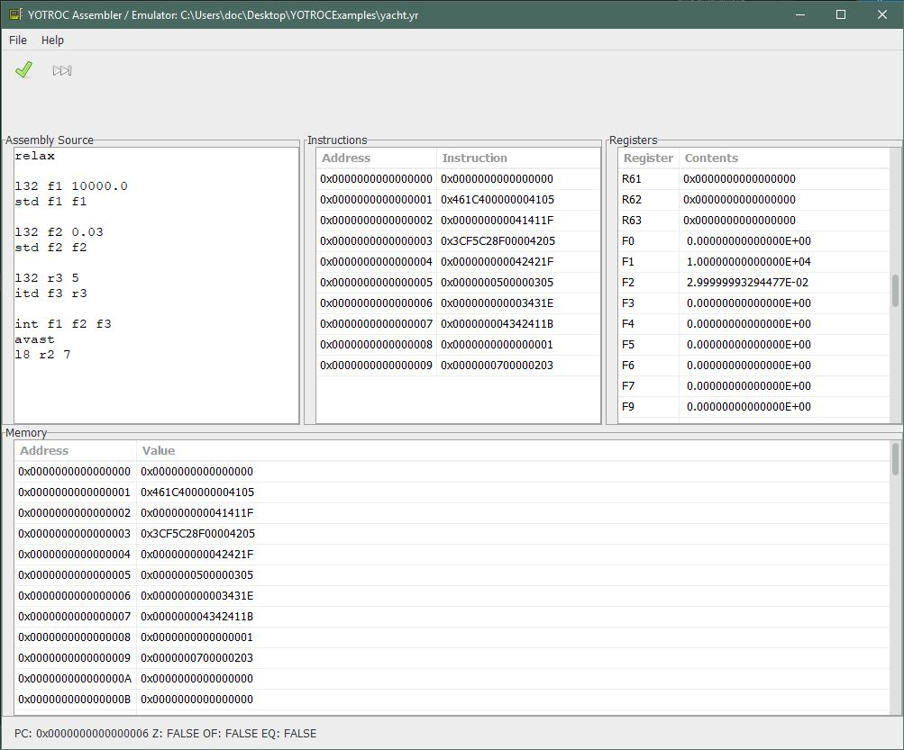

Introduction
============

**YOTROC** is a CPU architecture that powers the next generation of
over-priced toys for the discerning luxury shopper. Cost is no object,
and power consumption is somebody else's problem. Inspired by
Yacht Rock Radio on SiriusXM.

The **YOTROC** IDE, assembler and virtual machine were created by Jon
Andrew for Syracuse CIS655, Fall 2019.

**YOTROC** offers:
64 general-purpose registers,
64 floating-point registers and 64-bit-ish arithmetic.

The YOTROC IDE
==============

The **YOTROC** IDE allows you to open, save files and assemble them to object
code for execution in the **YOTROC** Virtual Machine. In the **YOTROC** VM,
you can inspect registers and step through instructions.

Assembly syntax:
================

Comments
--------
Comments start with `;` and stop at the end of a line.

    ; this is a comment

Assembly directives start with `%`.
-----------------------------------

    %define myvar 1234  ; defines an identifier called "myvar" with value 1234.
    add R1 R2 myvar     ; adds value 1234 to R2, places result in R1.

Labels
------
Labels start with `@` and have an identifier and can be used as a destination
for jump instructions. You can think of it as defining an identifier with
value of whatever address it is at.

    @loop               ; defines a label at this address
    ; other stuff
    cmp R1 R2           ; compare contents of R1 and R2
    jne loop            ; if they aren't equal, jump to @loop

Note that `%define`d identifiers and labels cannot use the name of a register,
must start with a letter and contain only letters and numbers. Identifiers 
and labels are case-*insensitive*.

Literals
========
The **YOTROC** assembler supports numeric literals only, and must be in Ada format
for bases other than 10. So 0xFFFF needs to be written as `16#FFFF#`. 0b10101 
would be written as `2#10101#`. Decimal (base 10) numbers are used by default, 
so `1042` and `12.4` are both valid numeric literals. Note that underscores are 
ignored, and can be used to make reading long numeric literals easier. For 
example: `16#FFFF_8000_0000_0000#` is a valid 64-bit numeric literal in 
YOTROC assembler.

Addressing Modes
================

Immediate Addressing (limited to signed 32-bit values)
------------------------------------------------------
Use a constant value, or value previously assigned to an identifier or label.

    l32 R1 1000       ; load register R1 with 1000
    l32 R2 myvar      ; load register R2 with contents of "myvar" identifier.

Register Addressing
-------------------
Use the contents of a register, or store into a register

    l64 R1 R2         ; load the contents of R2 into R1

Register Indirect
-----------------
Indirect addressing uses the register value as a pointer to memory. For
familiarity, the **YOTROC** assembler uses C-style pointer syntax. Note that
this is just a short-hand for the offset address `*(Rx + 0)`.

    l32 R1 16#BEEF#;  ; load R1 with the value 0xBEEF.
    s32 42 *R1        ; store the value 42 into the memory address 0xBEEF.

Displacement
------------
Displacement (or Offset) addressing uses a base address + displacement, 
where the base address must be a value
in a register. The syntax is `*(<GPR> + <OFFSET>)`, where GPR is a 
general purpose register, and offset is a 32-bit immediate.

    l32 R1 16#CAFD#   ; load R1 with the value 0xCAFD
    s32 42 *(R1 + 1)  ; store the value 42 into the memory address 0xCAFE.

Instruction Reference
=====================

Zero operand instructions (J TYPE)
----------------------------------
        relax       ; just chill. Called "nop" in less luxurious architectures.
        avast       ; pull this Yacht back into port and shut down.
        ret         ; return from function to address in link register (R63)

LOAD/STORE instructions (A,B,C,D TYPE, depending on operands)
-------------------------------------------------------------
LOAD: TO: Register, FROM: register, register indirect, displacement, immediate

        l8
        l16
        l32         ; load lower half (for immediates)
        l32u        ; load upper half (for immediates)
        l64

STORE: FROM: Register, TO: register indirect, displacement

        s8          ; R1 <location> -- Put lower 8 bits of R1's contents in <location>
        s16
        s32
        s64         ; R1 <location> -- Put all 64bits of R1's contents in <location>

Single-Bit instructions (G TYPE)
--------------------------------
        btc         ; R1 bit   -- R1 = R1 and (not 1 << bit) (bit clear)
        bts         ; R1 bit   -- R1 = R1 or (1 << bit)      (bit set)
        tb          ; R1 bit   -- test bit, sets Zero flag 

Arithmetic (3 operand) instructions (E TYPE)
--------------------------------------------
        add         ; R1 R2 R3 : R1 = R2 + R3
        sub         ; R1 R2 R3 : R1 = R2 - R3
        mul         ; R1 R2 R3 : R1 = R2 * R3
        div         ; R1 R2 R3 : R1 = R2 / R3

Floating-Point Arithmetic Operations (E TYPE)
---------------------------------------------
        fadd        ; f1 f2 f3 (FP)
        fsub        ; f1 f2 f3 (FP)
        fmul        ; f1 f2 f3 (FP)
        fdiv        ; f1 f2 f3 (FP)

(Note: append 'b' here for "bitwise", but also because they're keywords in Ada.)

        modb        ; R1 R2 R3 : R1 = R2 mod R3
        orb         ; R1 R2 R3 : R1 = R2 or R3  (bitwise)
        andb        ; R1 R2 R3 : R1 = R2 and R3 (bitwise)
        xorb        ; R1 R2 R3 : R1 = R2 xor R3 (bitwise)

YACHT instructions
------------------
Calculate compound interest:

        int         ; R1 R2 R3 : R1 = Principal, R2 = interest rate (float),
                    ;  R3 = time. Assumes annual compounding. Stores result back in
                    ; R1.

Arithmetic (2 operand) instructions (F TYPE)
--------------------------------------------
2-operand YACHT instructions

        knots       ; f1 f2   : convert R1 miles per hour into R1 knots.
        miles       ; f1 f2   : convert R2 knots to R1 miles per hour.

FLOATING-POINT CONVERSIONS

        itd         ; f1 R1   : convert integer value in R1 to a double in f1.
        std         ; f1 f2   : f1 = f2, f2 has a single-precision FP value, and f1 will be double-precision.

COUNT BITS

        cb          ; R1 R2   : R1 = # of bits set in R2

LOGICAL SHIFTS

        shll        ; R1 R2   : R1 << R2
        shrl        ; R1 R2   : R1 >> R2

COMPARISON

        cmp         ; R1 R2   : compare contents in registers

One-Operand Instructions (I-Type)
---------------------------------
BITWISE NOT

        notb        ; R1      : R1 = ~R1 (bitwise)

BRANCHES

        jmp         ; R1      : jump unconditional
        jz          ; R1      : jump to address in R if zero flag set
        jeq         ; R1      : jump to address in R if if comparison was equal
        jne         ; R1      : jump to address in R if not equal
        jlt         ; R1      : jump to address in R if less than
        jgt         ; R1      : jump to address in R if greater than

FUNCTION CALLS

        call        ; R1       : call function (jump and link, set R63 to next instruction on return.)

One-Operand Immediate Instructions (H-Type)
-------------------------------------------
"Jump Absolute"

        jmpa        ; immed. address
        jza        
        jeqa       
        jnea       
        jlta       
        jgta 

Limitations & Known Issues
==========================

YOTROC Virtual Machine
----------------------
Direct address jumps are limited to 32-bit absolute addresses for now. It would
be nice to support an option for PC-relative addressing in the future, perhaps
by using one of the reserved opcode bits.

The YOTROC architecture is strictly 64-bit *word* addressable for the time being.
This is strictly a limitation of the VM. Future releases should change to be 
byte-addressable.

Floating-point immediates are all limited to single-precision, but arithmetic
operations all require and expect double-precision operands. You can use the
"std" instruction to convert single-precision FP values in registers to
double-precision. The "itd" instruction converts integer values to
floating-point values.

The YOTROC VM is set up to use 256 words of memory, this limitation is
baked in to the source code.

YOTROC IDE
----------
The file menu doesn't support adding your own name for new files, so you
need to create an empty file first, and then select it when you Save As.
